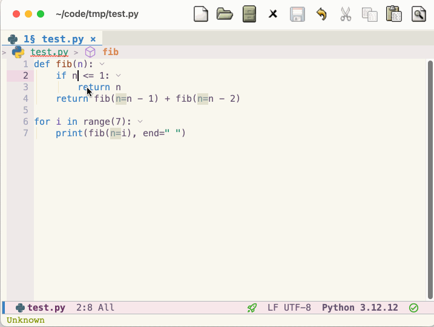

* python-rope.el

** Refactor python code vai rope
This package provider some refactoring code command.

Demo:

** Should I need this?
Now a day lsp can do code refactor. But some python lsp not support refactoring.
If you using pyrefly, you not need this package, it provide refactor features.
For me, I using ty as lsp and ruff as lint right now. But ty not support refactoring (right now is 2026-10-01).

Hum, Wait for ty to support these featurs.

** Dependencies
- [[https://github.com/python-rope/rope][python rope library]].

** Install

Clone this repository

#+BEGIN_SRC shell
git clone https://github.com/bigbuger/python-rope.el
#+END_SRC

Add to your load path and require it
#+BEGIN_SRC elisp
(add-to-list 'load-path "/path/to/python-rope.el")
(require 'python-rope)
(with-eval-after-load 'python
  (define-key python-base-mode-map (kbd "C-c <RET>") #'rope-transient)) ;; optionally, or pick your own key.
;; Or define your own key map. See below to find the commands.
#+END_SRC

** Usage
Use can call `rope-transient' to pop a menu,
or just call each `rope-*' command in a python buffer.

** Commands
*** rope-extract-variable
  Declare a new variable with the value of the selected expression.
  Need to select a region.
  
*** rope-extract-method
  Declare a new method of the selected expression.
  Need to select a region.
  
*** rope-inline-method
   Inline occurrences of a method at point.

*** rope-add-parameter
  *Need python-ts-mode*
  Add parameter to the functin at point.
  If current point is a parameter signature, add after current parameter,
  otherwise add at the end.
  Or you can use the prefix valur (aka, C-u) to specify the position of new parameter (start with 0).
  *Warning!: rope will remove all type hint*
  
*** rope-remove-parameter
  *Need python-ts-mode*
  Remove current parameter of function at point.
  Or you can use the prefix valur (aka, C-u) to specify the position of new parameter (start with 0).
  *Warning!: rope will remove all type hint*

*** rope-move
  Move a python element in the project.

*** rope-move-module
  Move a python moddule in the project.

** Customer variables
*** rope-python-executable
  Which python that rope has installed to.
  Default value is find by `executable-find' for "python3" (or "python" if "python3" not exists).
  It will execute when you load the python-rope.
  
  Yep, may be you has activated venv, or the python-rope is load under some other environment.
  So you should may sure that is the right python witch has the rope lib.

  +hum, python package management, what a terrible thing+

  
  +and I donn't know why rope not as a cli bin+
